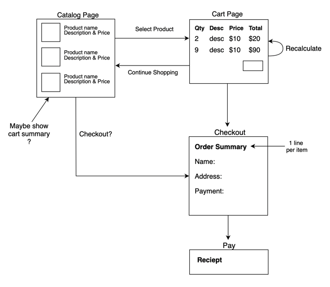
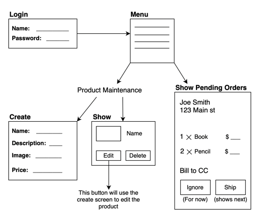
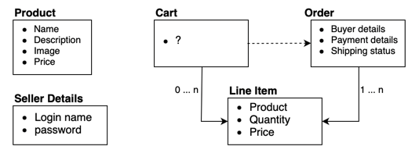

# README

The Depot Application

Things may want to cover:

* The buyer uses Depot to browse the products we have to sell, select some to purchase, and supply the information needed to create an order.

* The seller uses Depot to maintain a list of products to sell, determine the orders that are awaiting shipment, and mark orders as shipped.

> A buyer flow of the depot application
> > 

> A seller flow of the depot application
> > 

> Data flow
> > 